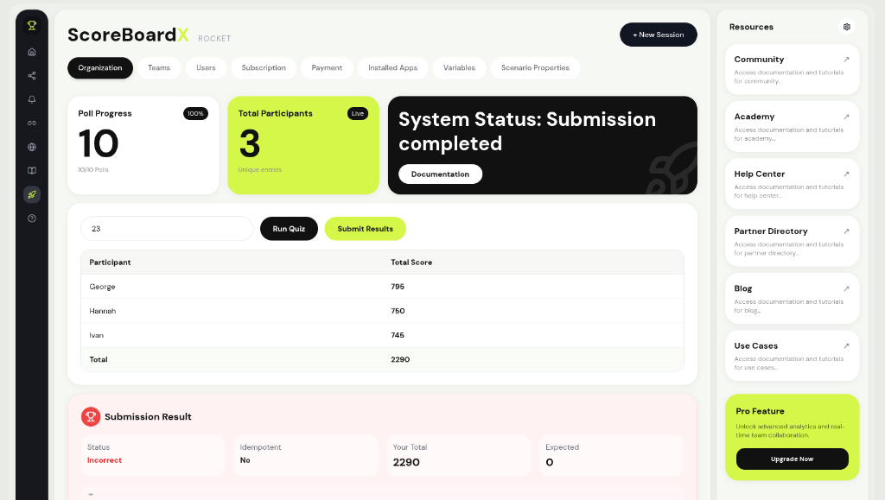

# 🏆 ScoreBoardX

[](https://spring.io/projects/spring-boot)
[](https://reactjs.org/)
[](https://vitejs.dev/)
[](https://tailwindcss.com/)

**ScoreBoardX** is a high-performance, real-time Quiz Leaderboard System designed for high-concurrency environments. It features a sleek, modern UI and a robust Spring Boot backend that integrates with external quiz APIs to provide live rankings and automated score submission.

## ✨ Live Preview



## 🚀 Features

- **Real-time Leaderboard**: Instant updates as participants score points.
- **Poll Synchronization**: Automated polling of external quiz data with deduplication.
- **SSE Integration**: Server-Sent Events (SSE) for low-latency progress tracking.
- **Modern UI**: A premium, dark-themed dashboard built with React and Tailwind CSS.
- **Deployment Ready**: Fully Dockerized for seamless scaling and production deployment.

## 🛠️ Tech Stack

### Backend
- **Framework**: Spring Boot 3.3.2 (Java 21)
- **APIs**: RESTful Services + SSE (Server-Sent Events)
- **Deduplication**: In-memory event tracking with Round/Participant isolation.
- **Client**: RestTemplate for external API orchestration.

### Frontend
- **Framework**: React 18 + Vite
- **Icons**: Lucide React
- **Styling**: Tailwind CSS (Custom Theme)
- **State Management**: React Hooks (useMemo, useEffect, useState)

## 📦 Installation & Setup

### Prerequisites
- Docker & Docker Compose (Recommended)
- Java 21+
- Node.js 20+
- Maven 3.9+

### Using Docker Compose (Fastest)

```bash
docker-compose up --build
```

### Manual Setup

#### Backend
```bash
cd backend
mvn clean install
mvn spring-boot:run
```

#### Frontend
```bash
cd frontend
npm install
npm run dev
```

## 🔌 API Endpoints

| Method | Endpoint | Description |
| :--- | :--- | :--- |
| `GET` | `/api/run?regNo={regNo}` | Trigger quiz polling & leaderboard generation |
| `POST` | `/api/submit?regNo={regNo}` | Submit finalized leaderboard to central system |
| `GET` | `/api/progress` | Subscribe to real-time progress updates (SSE) |

## 🚢 Deployment Readiness

ScoreBoardX is production-ready with:
- **Environment Variable Support**: Configure `VITE_API_BASE` for different environments.
- **Optimized Builds**: Multi-stage Docker builds for minimal image size.
- **CORS Configuration**: Secure cross-origin resource sharing.

---

Built with ❤️ by [Arnazz10](https://github.com/Arnazz10)
